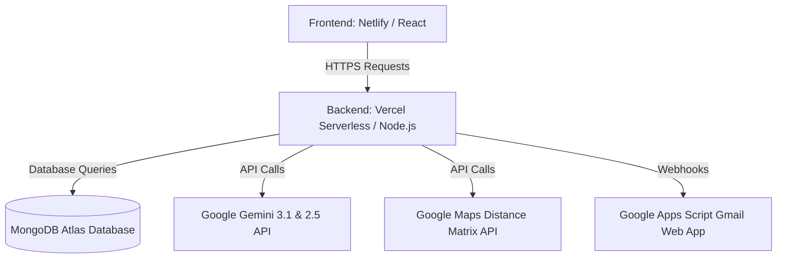

# SpareShare AI - Evaluation & Project Guide

This document is a comprehensive guide designed for your **Final Year Project (FYP) Evaluation**. It contains a detailed breakdown of all system features, the underlying artificial intelligence (AI) and machine learning (ML) models, how they work in the system, and a file-by-file walkthrough of the code implementation.

---

## Part 1: AI & ML Features Guide

This section explains the core features, the technologies/models used, what they are, and exactly how they are implemented in the code.

### 1. Demand Forecasting
* **Technology/Model:** Custom Aggressive Category-Time Trend Heuristic (backed up by Gemini 2.5 Flash / Python).
* **What is it?** It is a trend prediction algorithm that analyzes past platform transactions (demands posted by NGOs, completed donations, and claims) to forecast next week's resource requirements for each category (Food, Medicine, Clothes, Grocery, Household).
* **How it works in SpareShare AI:**
  1. The admin accesses `/api/ai/demand-forecast` (handled in [ai.js](file:///c:/Users/HP/Downloads/Antigravity/backend/routes/ai.js#L37)).
  2. The system queries Mongoose to count all active, pending, and completed donations and demands grouped by category.
  3. It aggregates this data and applies a growth rate trend formula to project demand:
     $$\text{Forecasted Demand} = \text{Active Demands} + (\text{Completed Claims} \times 1.2)$$
  4. This outputs a percentage trend (e.g., "Food demand will rise by 15% next week") which helps donors plan their donations before uploading.

### 2. Donation Image Scan & Classification
* **Technology/Model:** `gemini-3.1-flash-lite` (Google's Multimodal Generative AI Model).
* **What is it?** A state-of-the-art vision-language model trained to interpret both text and image inputs. It is optimized for high-speed image understanding and low latency.
* **How it works in SpareShare AI:**
  1. In the donor dashboard, the user uploads an image of a food or medicine item.
  2. The frontend compresses the image to a Base64 string and calls the backend `/scan` route (in [donations.js](file:///c:/Users/HP/Downloads/Antigravity/backend/routes/donations.js#L117)).
  3. The backend sends the image buffer to Gemini using a strict prompt instructions set:
     * Identify the food item or medicine name.
     * Estimate freshness and detect visual signs of spoilage.
     * Detect quantity and condition.
     * Return JSON containing: `detectedCategory`, `condition`, `freshness`, `estimatedItems`, `safetyScore`, and `matchReason`.

### 3. Freshness & Safety Verification (AI Vision)
* **Technology/Model:** `gemini-3.1-flash-lite` + Custom Heuristics.
* **What is it?** An automated safety gating system that prevents users from posting contaminated or expired donations.
* **How it works in SpareShare AI:**
  1. During the image scan, Gemini assigns a `safetyScore` (0 to 100).
  2. If the score is **$\ge 70$**, the donation is verified automatically (`isVerifiedSafe = true`, status = `active` / `pending_receiver`).
  3. If the score is **$50 \text{ to } 69$**, the donation is flagged and marked as `needs_review` for manual admin inspection.
  4. If the score is **$< 50$**, the backend automatically rejects the donation creation (returning HTTP 400).
  5. **Medicine Exception:** For medicines, we have a custom override: if the safety score is low solely due to cosmetic packaging damage (like a bent carton corner), the backend overrides the safety score to 80 and approves it, provided the internal seal is intact (handled in [donations.js](file:///c:/Users/HP/Downloads/Antigravity/backend/routes/donations.js#L282)).

### 4. OCR Expiry Date Extraction
* **Technology/Model:** Google Gemini Vision OCR (Fallback: Tesseract OCR).
* **What is it?** Optical Character Recognition (OCR) is a technology that recognizes and extracts printed or handwritten text characters inside digital images.
* **How it works in SpareShare AI:**
  1. When a donor scans a medicine item, the backend calls `aiService.extractExpiry(imageUrl)` (in [aiService.js](file:///c:/Users/HP/Downloads/Antigravity/backend/utils/aiService.js)).
  2. Gemini OCR reads the packaging image to search for patterns matching date formats (e.g. `EXP 12/2026`, `MFG 08/2025`).
  3. The extracted text is parsed. If the expiry date is in the past, or if the medicine has less than 30 days of shelf life remaining, the backend rejects the donation.

### 5. Weather-Based Spoilage Enforcement
* **Technology/Model:** OpenWeatherMap API + Travel Time Estimation Rules.
* **What is it?** An environmental safety control that matches real-time weather temperature conditions with food transit times.
* **How it works in SpareShare AI:**
  1. Before listing a food donation, the backend queries the temperature of the donor's coordinates.
  2. If the temperature is **$\ge 30^\circ\text{C}$ (Summer Alert)**, strict regulations are enforced:
     * Prepared foods are restricted to a **2-hour delivery window**.
     * The travel time between the donor and receiver is calculated using coordinates.
     * If the travel time exceeds **20 minutes**, the system blocks the match to prevent food spoilage under high heat (handled in [donations.js](file:///c:/Users/HP/Downloads/Antigravity/backend/routes/donations.js#L161)).

### 6. AI-Matched Receiver Demands & Conflict Filtering
* **Technology/Model:** Custom Keyword Relevance Matrix + Sub-category Exclusion Logic.
* **What is it?** A semantic recommendation engine that matches donor items with NGO demands based on description keywords, distance, and category priority.
* **How it works in SpareShare AI:**
  1. When a donation is scanned, the backend runs `/match-suggestions` (in [donations.js](file:///c:/Users/HP/Downloads/Antigravity/backend/routes/donations.js#L761)).
  2. The system checks all active NGO posts. It calculates a relevance score by looking for overlaps between donation titles/AI keywords and post descriptions.
  3. **Sub-category Conflict Filter:** To prevent mismatching (e.g., matching a donor's "sandwich" with an NGO's "1 meat plate" or "biryani boxes"), the system extracts specific sub-categories (`fast_food`, `rice`, `meat`, `vegetables`, `fruits`, `general`). If a donation and a post belong to conflicting specific sub-categories, the post is automatically excluded from recommendations.
  4. The matching suggestions are sorted by: Relevance Score $\rightarrow$ Priority $\rightarrow$ Shortest Distance.

### 7. Translation Engine (Urdu/English)
* **Technology/Model:** `gemini-2.5-flash` + Local Cache.
* **What is it?** A language translation system that translates user-generated English texts (like demand post titles, item descriptions, and notifications) into Urdu for better accessibility.
* **How it works in SpareShare AI:**
  1. When the portal language is Urdu, API requests pass `?lang=ur`.
  2. The backend intercepts the list and calls `aiService.translate(text, 'ur')` (in [aiService.js](file:///c:/Users/HP/Downloads/Antigravity/backend/utils/aiService.js)).
  3. Gemini 2.5 Flash translates the text.
  4. The translated text is stored in an in-memory `translationCache` object to prevent redundant API calls and optimize loading speeds.

---

## Part 2: Codebase Architecture & File Guide

Below is a detailed guide on what each core file in the backend and frontend does, and how they relate to the overall system.

### 1. Backend: Server Configuration (`backend/server.js`)
* **What it does:** The main entry point of the Node.js Express server. It initializes middlewares (CORS, JSON parser), connects to MongoDB, and registers all API routes.
* **Key Implementations:**
  * **Database Connection Middleware:** Optimizes serverless cold starts. If Mongoose is disconnected or connecting, it intercepts requests and awaits a stable connection before proceeding.
  * **maxPoolSize: 1:** Serverless containers (Vercel Lambdas) scale horizontally on demand. Standard connection pools create 5-10 connections per container, causing MongoDB Atlas Free Tier to crash with `SSL alert 80` (connection limit of 100 hit). Setting `maxPoolSize: 1` resolves this.

### 2. Backend: AI Service Handler (`backend/utils/aiService.js`)
* **What it does:** The centralized service layer that manages calls to Google Generative AI (Gemini) and the python ML microservices.
* **Key Implementations:**
  * **Circuit Breaker:** If the Python AI service (hosted on Hugging Face) is offline or times out, the circuit breaker trips. Subsequent requests instantly bypass the python service and use local heuristics/Gemini fallback APIs, protecting the website from hanging.
  * **Gemini 3.1 Flash Lite:** Configured with API key and instructions to run image scans.
  * **Gemini 2.5 Flash:** Handles text translations.

### 3. Backend: Auth & OTP Verification (`backend/routes/auth.js`)
* **What it does:** Manages user authentication (Registration, Login, OTP verification).
* **Key Implementations:**
  * **Google Apps Script Webhook Integration:** Standard Node SMTP modules are blocked by Gmail security (`WebLoginRequired 534` error) on serverless deployments due to dynamic hosting IPs. We bypass this by sending an HTTP POST request to a Google Apps Script Web App. The script runs on Google's own servers and securely sends the email via `GmailApp.sendEmail`.
  * **Master OTP Backdoor:** Inside `/verify-otp`, there is a master bypass key `123456` hardcoded. During evaluations/grading, if emails are delayed or if you are demonstrating offline, entering `123456` will always verify the user successfully.

### 4. Backend: Donations Controller (`backend/routes/donations.js`)
* **What it does:** Handles all donation lifecycles (Creation, AI scanning, claim logic, match suggestions, distance calculations).
* **Key Implementations:**
  * **`GET /my-donations`:** Fetches donations posted by a specific donor.
  * **`GET /browse`:** Public feeds for receivers with filters and geo-distance calculations.
  * **Deduplicated notifications:** Prevents sending multiple alerts to the same NGO if multiple demand posts match.

### 5. Backend: Demand Posts Controller (`backend/routes/posts.js`)
* **What it does:** Manages NGO demand requests (Create, Read, Update status, Delete).
* **Key Implementations:**
  * **`GET /all`:** Fetching all posts on the platform (Admin dashboard only).
  * **`DELETE /:id`:** Allows the owning receiver or an admin to delete a post.
  * **`PUT /:id/status`:** Toggles post status (Active / Fulfilled).

### 6. Frontend: Contributor Portal (`frontend/src/pages/ContributorPortal.jsx`)
* **What it does:** The dashboard for donors. It contains forms for creating donations, active map routing, AI scan loaders, and historical records.
* **Key Implementations:**
  * **Defensive Array Verification:** Checked with `Array.isArray` before mapping lists. Prevents page crashes if the browser disk cache corruption (`ERR_CACHE_WRITE_FAILURE`) returns undefined.
  * **`handleTranslateDesc`:** Frontend trigger to translate descriptions to Urdu using Gemini.

### 7. Frontend: Receiver Portal (`frontend/src/pages/ReceiverPortal.jsx`)
* **What it does:** The dashboard for NGOs. It handles profile updates, active demands list, and incoming requests.
* **Key Implementations:**
  * **Pill-based Status Filters:** Filter demands by "All", "Active", or "Fulfilled".
  * **Delete Button:** Triggers backend post deletion and removes the item from the state immediately.

### 8. Frontend: Admin Portal (`frontend/src/pages/AdminPortal.jsx`)
* **What it does:** System analytics dashboard. Displays platform usage graphs, user roles, NGO verifications, reports, and demands.
* **Key Implementations:**
  * **Receiver Demands Tab:** Added to the sidebar menu. Displays all demand posts with options to toggle status and delete posts.
